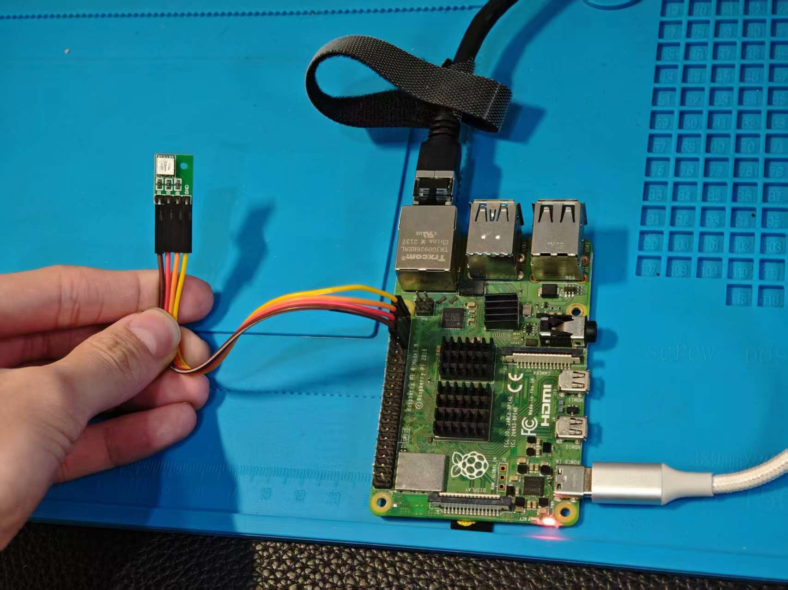
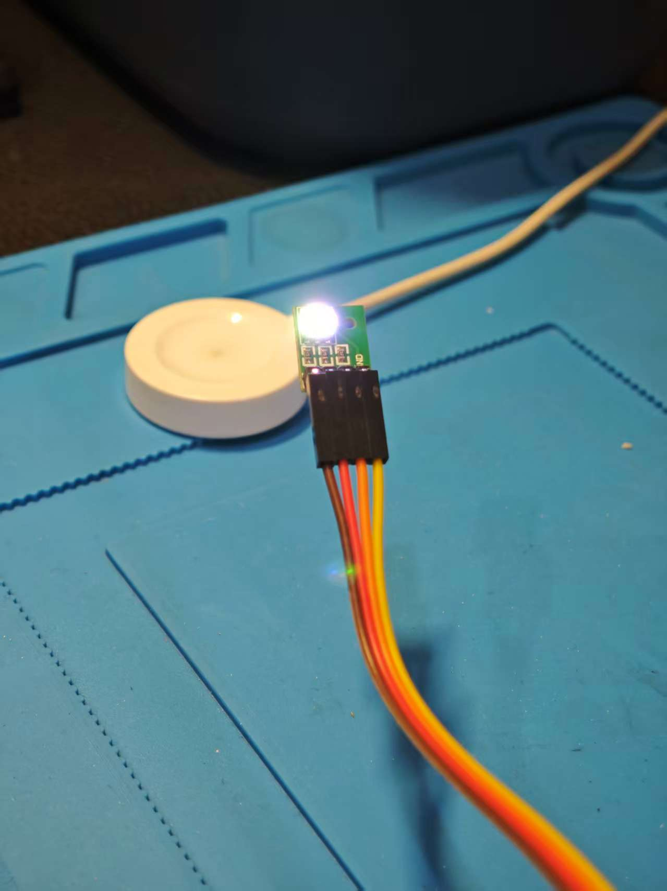

---

# 01_gpio_led

> 基于 platform_driver + Device Tree + gpiod + timer + sysfs 的 RGB LED 内核驱动示例
> 运行平台：Raspberry Pi 4 (bcm2711)

---

# 一、项目简介

本项目实现一个基于 GPIO 的 RGB LED 驱动，主要特性：

* 使用 **platform_driver** 驱动模型
* 通过 **Device Tree Overlay** 创建设备
* 使用 **gpiod 接口** 获取 GPIO
* 使用 **内核定时器 timer_list** 实现闪烁
* 通过 **sysfs** 动态修改：

  * 闪烁周期
  * RGB 颜色组合

该项目属于 Linux 驱动学习的第一个模块：GPIO 基础控制。

---

# 二、硬件连接

## 2.1 接线说明

| 颜色  | GPIO(BCM) | 物理引脚   | 说明         |
| --- | --------- | ------ | ---------- |
| R   | 13        | Pin 33 | 串联 220Ω 电阻 |
| G   | 19        | Pin 35 | 串联 220Ω 电阻 |
| B   | 26        | Pin 37 | 串联 220Ω 电阻 |
| GND | GND       | 任意     | 共阴极        |

> 使用共阴极 RGB LED

---

## 2.2 实物连接图



---

# 三、设备树 Overlay

文件：`myled-overlay.dts`

```dts
/dts-v1/;
/plugin/;

/ {
    compatible = "brcm,bcm2711";

    fragment@0 {
        target-path = "/";
        __overlay__ {
            myled {
                compatible = "mycompany,myled";
                led-r-gpios = <&gpio 13 0>;
                led-g-gpios = <&gpio 19 0>;
                led-b-gpios = <&gpio 26 0>;
            };
        };
    };
};
```

---

## 编译 overlay

```bash
dtc -@ -I dts -O dtb -o myled.dtbo myled-overlay.dts
sudo cp myled.dtbo /boot/overlays/
```

编辑 `/boot/config.txt` 添加：

```
dtoverlay=myled
```

重启系统：

```bash
sudo reboot
```

---

# 四、驱动编译与加载

## 4.1 编译

```bash
make
```

## 4.2 加载模块

```bash
sudo insmod gpio_led.ko
```

## 4.3 查看内核日志

```bash
dmesg | grep myled
```

### 运行截图


期望输出：

```
myled: GPIO 13 19 26 LED blink driver loaded
```

---

# 五、sysfs 接口

驱动加载后，会在：

```
/sys/devices/platform/myled/
```

生成两个属性文件：

```
period_ms
rgb_color
```

查看目录截图：


---

# 六、功能测试

## 6.1 修改闪烁周期

```bash
echo 1000 | sudo tee /sys/devices/platform/myled/period_ms
```

单位：毫秒
最小限制：10ms

---

## 6.2 修改颜色

颜色为 0~7 的 bitmask：

| 数值 | 颜色 |
| -- | -- |
| 0  | 熄灭 |
| 1  | 红  |
| 2  | 绿  |
| 3  | 黄  |
| 4  | 蓝  |
| 5  | 紫  |
| 6  | 青  |
| 7  | 白  |

示例：

```bash
echo 7 | sudo tee /sys/devices/platform/myled/rgb_color
```

### 白光闪烁效果



---

# 七、驱动架构说明

驱动整体流程：

```
Device Tree
      ↓
platform_device
      ↓
platform_driver
      ↓
probe()
      ↓
devm_gpiod_get()
      ↓
timer_setup()
      ↓
sysfs 属性创建
```

---

# 八、涉及的内核知识点

* platform_driver 注册机制
* of_match_table 设备匹配
* devm_gpiod_get GPIO 资源管理
* timer_list 定时器机制
* from_timer 宏使用
* sysfs 设备属性创建
* device_create_file
* mod_timer 与 jiffies
* msecs_to_jiffies 转换机制

---

# 九、目录结构

```
01_gpio_led/
├── gpio_led.c
├── myled-overlay.dts
├── Makefile
├── README.md
└── images/
    ├── hardware.jpg
    ├── dmesg.png
    ├── sysfs_ls.png
    └── blink_white.jpg
```

---

# 十、项目总结

本项目实现了一个完整的：

* 设备树 + 平台驱动
* GPIO 资源管理
* 内核定时器
* sysfs 用户接口

属于嵌入式 Linux 驱动开发中的基础模块。

后续模块将逐步扩展到：

* 中断（gpio_keys）
* PWM 子系统
* IIO 子系统
* SPI 驱动
* LED class 子系统
* ASoC 音频子系统

---

# 项目定位

该项目是 Linux 驱动学习路线中的第一阶段基础项目，为后续复杂驱动打基础。

---