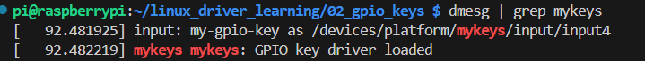
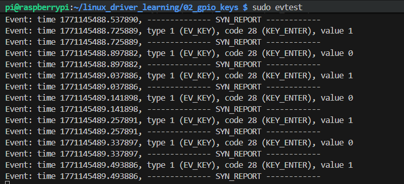

---

# 02_gpio_keys

> 基于 platform_driver + GPIO + IRQ + Input Subsystem 的单按键驱动示例
> 运行平台：Raspberry Pi 4 (bcm2711)

---

# 一、项目简介

本项目实现一个基于 GPIO 的按键驱动，采用 Linux 标准输入子系统（input subsystem）进行按键事件上报。

主要特性：

* 使用 `platform_driver` 驱动模型
* 通过 Device Tree Overlay 创建设备
* 使用 `gpiod` 接口获取 GPIO
* GPIO 转换为 IRQ
* 使用 `devm_request_threaded_irq`
* 接入 Linux input 子系统
* 生成 `/dev/input/eventX`
* 支持简单软件消抖

该项目是 Linux 驱动学习路线的第二阶段：
从“主动控制设备”进入“中断驱动模型”。

---

# 二、硬件连接

## 2.1 接线说明

| 功能   | GPIO(BCM) | 物理引脚   | 说明     |
| ---- | --------- | ------ | ------ |
| KEY1 | 26        | Pin 32 | GPIO26 |
| GND  | GND       | 任意     | 按键接地   |

接法说明：

```
BCM26 ---- 按键 ---- GND
```

使用：

```
GPIO_ACTIVE_LOW
```

表示按下时为低电平。

---

## 2.2 实物连接图


---

# 三、设备树 Overlay

文件：`mykeys-overlay.dts`

```dts
/dts-v1/;
/plugin/;

/ {
    compatible = "brcm,bcm2711";

    fragment@0 {
        target-path = "/";
        __overlay__ {
            mykeys {
                compatible = "mycompany,mykeys";
                key-gpios = <&gpio 17 1>;
            };
        };
    };
};
```

---

## 编译 overlay

```bash
dtc -@ -I dts -O dtb -o mykeys.dtbo mykeys-overlay.dts
sudo cp mykeys.dtbo /boot/overlays/
```

编辑 `/boot/firmware/config.txt`：

```
dtoverlay=mykeys
```

重启：

```bash
sudo reboot
```

---

# 四、驱动编译与加载

## 4.1 编译

```bash
make
```

## 4.2 加载模块

```bash
sudo insmod gpio_keys.ko
```

## 4.3 查看内核日志

```bash
dmesg | grep mykeys
```

### dmesg 截图



期望输出：

```
GPIO key driver loaded
```

---

# 五、Input 子系统验证

驱动加载成功后，会自动注册 input 设备。

## 5.1 查看 input 设备

```bash
cat /proc/bus/input/devices
```

截图：


你应看到：

```
N: Name="my-gpio-key"
```

---

## 5.2 使用 evtest 测试

安装：

```bash
sudo apt install evtest
```

运行：

```bash
sudo evtest
```

选择：

```
my-gpio-key
```

按下按键，输出类似：

```
Event: type 1 (EV_KEY), code 28 (KEY_ENTER), value 1
Event: type 1 (EV_KEY), code 28 (KEY_ENTER), value 0
```

截图：



---

# 六、驱动架构说明

整体调用流程：

```
Device Tree
      ↓
platform_device
      ↓
platform_driver
      ↓
probe()
      ↓
devm_gpiod_get()
      ↓
gpiod_to_irq()
      ↓
devm_request_threaded_irq()
      ↓
IRQ Thread Handler
      ↓
input_report_key()
      ↓
input_sync()
      ↓
/dev/input/eventX
```

---

# 七、关键技术点

* platform_driver 注册机制
* gpiod 接口使用
* GPIO → IRQ 转换
* 中断触发机制（上升沿 / 下降沿）
* threaded irq
* input 子系统架构
* input_report_key
* input_sync
* Linux 事件驱动模型

---

# 八、目录结构

```
02_gpio_keys/
├── gpio_keys.c
├── mykeys-overlay.dts
├── Makefile
├── README.md
└── images/
    ├── hardware.jpg
    ├── dmesg.png
    ├── input_devices.png
    └── evtest.png
```

---

# 九、项目意义

本项目标志着从：

```
GPIO 控制
    ↓
进入
    ↓
中断驱动模型
    ↓
接入内核子系统
```

属于嵌入式 Linux 驱动开发中的核心阶段。

---

# 十、阶段总结

本章完成内容：

* 中断注册与释放
* IRQ 触发机制
* 软件消抖处理
* Input 子系统接入
* 生成标准 Linux 输入事件

为后续学习：

* PWM 子系统
* I2C 传感器
* IIO 框架
* SPI 驱动
* ASoC 音频子系统

打下基础。

---

# 项目定位

Linux 驱动学习路线第二阶段 —— GPIO 中断与输入子系统。

---