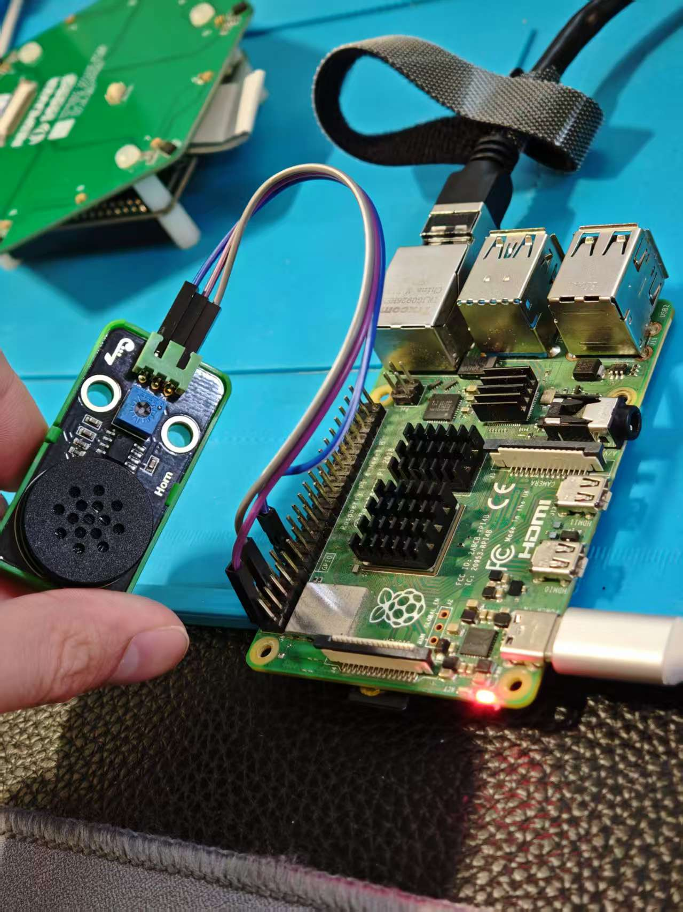
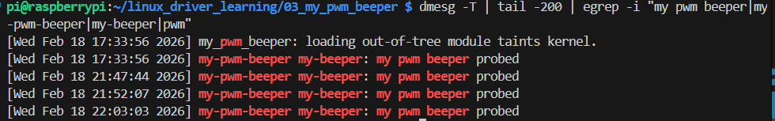

# 03_my_pwm_beeper

> 基于 platform_driver + PWM Subsystem 的蜂鸣器（Beeper）驱动示例  
> 运行平台：Raspberry Pi 4（bcm2711）  
> 输出方式：PWM 方波（可通过 RC 滤波后更接近“模拟”声音）

---

## 一、项目简介

本项目实现一个简单的 PWM 蜂鸣器驱动，并提供应用层示例程序播放《小星星》。

主要特性：

- 使用 `platform_driver` 驱动模型
- 通过 Device Tree Overlay 创建设备节点
- 使用 PWM 子系统接口 `devm_pwm_get()`
- 通过 sysfs 暴露频率控制接口：  
  ` /sys/devices/platform/my-beeper/freq `
- 支持 `freq=0` 关闭蜂鸣器
- 附带 `twinkle.c`：通过写 sysfs 频率播放旋律

该项目是 Linux 驱动学习路线的第三阶段：  
从“GPIO/中断事件”进入“PWM 子系统 + 简单用户态控制”。

---

## 二、硬件连接

### 2.1 接线说明（示例）

| 功能 | PWM 输出(BCM) | 物理引脚 | 说明 |
|------|--------------|----------|------|
| PWM0 | 18           | Pin 12   | 硬件 PWM0 |
| GND  | GND          | 任意     | 共地 |

蜂鸣器与 RC 滤波板（如你提到的 RC 有源滤波 CN7x52）建议按你现有电路连接方式接入 PWM 输出端。

> 注意：如果你的蜂鸣器是“有源蜂鸣器”（上 5V 自己会响那种），那它本质是固定频率自激，PWM 调频意义不大；  
> 本项目更适合“无源蜂鸣器 / 小喇叭 + RC 滤波”这类需要外部方波驱动的负载。

### 2.2 实物连接图

把你的图片放到：

- `images/hardware.jpg`

并在这里展示：



---

## 三、设备树 Overlay

文件：`my-beeper.dts`

```dts
/dts-v1/;
/plugin/;

/ {
    compatible = "brcm,bcm2711";

    fragment@0 {
        target-path = "/";
        __overlay__ {
            my_beeper: my-beeper {
                compatible = "my,pwm-beeper";
                pwms = <&pwm 0 1000000 0>;
            };
        };
    };
};
````

说明：

* `pwms = <&pwm 0 1000000 0>;`

  * `&pwm`：Raspberry Pi 的 PWM 控制器
  * `0`：PWM 通道 0（对应 BCM18 常用）
  * `1000000`：默认周期 1ms（这里只是初始值，真正播放时会在驱动里根据 `freq` 动态改 period）
  * 最后一个 `0`：polarity（默认）

---

## 四、编译与加载

### 4.1 编译 overlay

```bash
dtc -@ -I dts -O dtb -o my-beeper.dtbo my-beeper.dts
sudo cp my-beeper.dtbo /boot/overlays/
```

编辑 `/boot/firmware/config.txt`（你的文件里已经有这些示例）：

```txt
dtoverlay=pwm,pin=18,func=2
dtoverlay=my-beeper
```

重启：

```bash
sudo reboot
```

> 说明：
> `dtoverlay=pwm,pin=18,func=2` 用于打开硬件 PWM，并把 BCM18 复用为 PWM 功能。
> `dtoverlay=my-beeper` 用于创建 `platform_device`（my-beeper），匹配驱动的 compatible。

---

### 4.2 编译驱动模块

在 `03_my_pwm_beeper/` 目录下：

```bash
make
```

会生成：

* `my_pwm_beeper.ko`

---

### 4.3 加载模块

```bash
sudo insmod my_pwm_beeper.ko
```

查看日志：

```bash
dmesg -T | tail -200 | egrep -i "my pwm beeper|my-pwm-beeper|my-beeper|pwm"
```

你应看到类似：

```
my pwm beeper probed
```

把你的截图放到：

* `images/dmesg.png`

并在这里展示：



---

## 五、功能验证（sysfs）

驱动加载后，会生成 sysfs 节点：

```bash
ls -l /sys/devices/platform/my-beeper/freq
cat /sys/devices/platform/my-beeper/freq
```

### 5.1 手动发声测试

* 发 440Hz（A4）：

```bash
echo 440 | sudo tee /sys/devices/platform/my-beeper/freq
```

* 停止：

```bash
echo 0 | sudo tee /sys/devices/platform/my-beeper/freq
```

---

## 六、播放《小星星》（应用层）

项目自带 `twinkle.c`，会通过写 sysfs `freq` 播放旋律。

### 6.1 编译

```bash
gcc -O2 -Wall -o twinkle twinkle.c
```

### 6.2 运行

```bash
sudo ./twinkle
```

> 如果你听到的声音比较“尖锐/刺耳”，通常是因为：
> PWM 方波谐波很强，RC 滤波/功放/负载特性会影响音色。
> 你可以尝试调整 RC 滤波参数，或后续升级为“PWM + DMA 音频”/“I2S 声卡”等更标准的音频输出方案。

---

## 七、驱动架构说明

整体调用流程：

```
Device Tree Overlay
        ↓
platform_device (my-beeper)
        ↓
platform_driver (my-pwm-beeper)
        ↓
probe()
        ↓
devm_pwm_get()
        ↓
device_create_file(freq)
        ↓
用户态 echo <freq> > freq
        ↓
freq_store()
        ↓
pwm_apply_might_sleep()
        ↓
蜂鸣器发声
```

---

## 八、关键实现点

### 8.1 sysfs 属性 freq

* 读：`freq_show()` 返回当前频率
* 写：`freq_store()` 接收频率 Hz

  * `freq == 0`：关闭 PWM
  * `freq > 0`：计算 period，并设置 50% 占空比

关键计算：

```c
period = DIV_ROUND_CLOSEST_ULL(NSEC_PER_SEC, freq);
duty   = period / 2;
```

---

## 九、目录结构

```
03_my_pwm_beeper/
├── my_pwm_beeper.c
├── my-beeper.dts
├── my-beeper.dtbo
├── Makefile
├── twinkle.c
└── images/
    ├── hardware.jpg
    └── dmesg.png
```

---

## 十、常见问题排查

### 10.1 写 freq 没声音

1. 确认 PWM overlay 是否启用：

```bash
grep -n "dtoverlay=pwm" /boot/firmware/config.txt
```

2. 确认设备节点是否存在：

```bash
ls -l /sys/devices/platform/my-beeper/
```

3. 确认 sysfs 节点是否存在：

```bash
ls -l /sys/devices/platform/my-beeper/freq
```

4. 确认驱动是否绑定成功：

```bash
ls -l /sys/bus/platform/devices/my-beeper/driver
```

5. 看内核日志有没有 defer / pwm 获取失败等信息：

```bash
dmesg -T | egrep -i "my|beeper|pwm|defer|error" | tail -200
```

---

## 十一、项目意义

本项目把“PWM 硬件输出”通过 Linux 标准框架（PWM subsystem）抽象成驱动，并提供最小可用的用户态接口，完成从：

```
内核驱动 → sysfs 控制 → 用户态播放
```