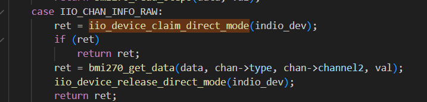
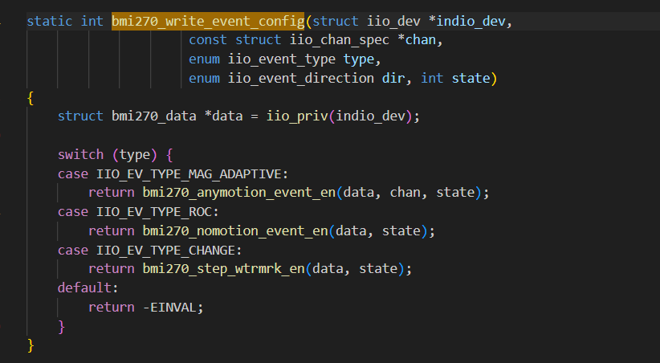
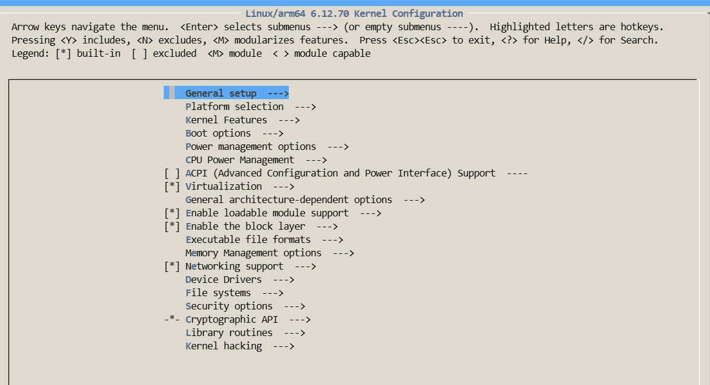
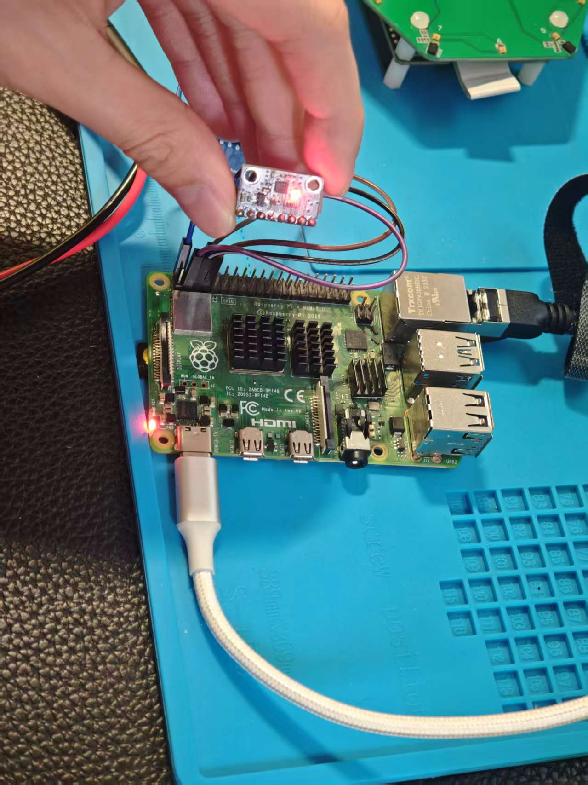
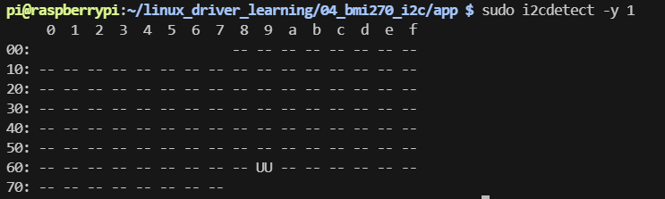
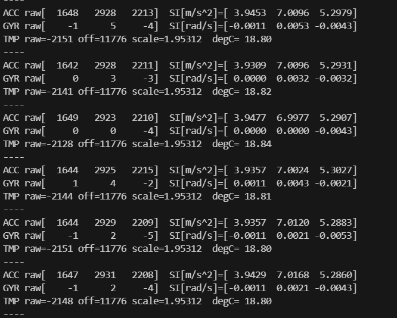

# BMI270 移植到 Raspberry Pi (Linux 6.12) 完整工程实践指南

------

# 一、项目目标

本项目目标是在 **Raspberry Pi（Linux 6.12 内核）** 上成功移植并运行 **主线 Linux 内核 BMI270 IIO 驱动**，最终实现：

- ✅ 成功编译生成模块：

  ```
  bmi270.ko
  bmi270_i2c.ko
  ```

- ✅ 正确加载初始化固件 `bmi270-init-data.fw`

- ✅ 正常注册 IIO 设备

- ✅ 在 `/sys/bus/iio/devices/` 下读取：

  - 加速度数据（raw）
  - 陀螺仪数据（raw）
  - scale
  - 触发 buffer 数据

- ✅ 用户态程序读取传感器数据

------

# 二、整体移植流程总览

```
获取主线驱动源码
        ↓
合入 Raspberry Pi 内核树
        ↓
解决 6.12 API 兼容问题
        ↓
编译内核模块
        ↓
部署固件
        ↓
添加 Device Tree Overlay
        ↓
验证 IIO 设备注册
        ↓
用户态读取数据
```

------

# 三、准备工作

------

## 1️⃣ 获取 BMI270 主线驱动源码

主线内核路径：

```
drivers/iio/imu/bmi270/
```

复制到你的学习目录：

```
/home/pi/linux_driver_learning/04_bmi270_i2c/bmi270
```

文件列表：

- bmi270_core.c
- bmi270_i2c.c
- bmi270_spi.c
- bmi270.h
- Kconfig
- Makefile

> 建议保留原始版本用于 diff 对比。

------

## 2️⃣ 获取 Raspberry Pi 6.12 内核源码

```bash
sudo apt update
sudo apt install -y git bc bison flex libssl-dev make libncurses5-dev

mkdir -p ~/rpi
cd ~/rpi
git clone --depth=1 https://github.com/raspberrypi/linux.git
cd linux
```

------

# 四、将驱动合入内核树

------

## 1️⃣ 创建驱动目录

```bash
mkdir -p drivers/iio/imu/bmi270
cp -a ~/linux_driver_learning/04_bmi270_i2c/bmi270/* drivers/iio/imu/bmi270/
```

------

## 2️⃣ 修改 Kconfig

编辑：

```
drivers/iio/imu/Kconfig
```

追加：

```plaintext
source "drivers/iio/imu/bmi270/Kconfig"
```

------

## 3️⃣ 修改 Makefile

编辑：

```
drivers/iio/imu/Makefile
```

追加：

```make
obj-$(CONFIG_BMI270) += bmi270/
```

------

# 五、解决 Linux 6.12 API 兼容问题（核心部分）

由于 Raspberry Pi 内核版本与主线存在差异，需要进行 API 适配。

------

## 1️⃣ direct_mode API 变化

### ❌ 原写法

```c
iio_device_claim_direct(indio_dev)
```

### ✅ 6.12 适配写法

```c
ret = iio_device_claim_direct_mode(indio_dev);
if (ret)
    return ret;
```

📌 修改示意图：



### 原因分析

在较新的 IIO 子系统中：

```
iio_device_claim_direct()
```

被替换为：

```
iio_device_claim_direct_mode()
```

并且需要显式检查返回值。

------

## 2️⃣ write_event_config 参数类型修改

### ❌ 原版本

```c
bool state
```

### ✅ 修改为

```c
int state
```

📌 修改示意图：



### 原因

IIO 子系统在 6.x 统一将 event config 接口参数改为 `int state`。

------

## 3️⃣ 移除 symbol namespace

### ❌ 原代码

```c
EXPORT_SYMBOL_NS_GPL(..., IIO_BMI270);
```

### ✅ 修改为

```c
EXPORT_SYMBOL_GPL(...);
```

📌 修改示意图：


### 原因

Raspberry Pi 内核默认未启用 symbol namespace 支持。

------

## 4️⃣ 修复 buffer 采集异常（关键修复）

### 问题现象

在使用 buffer 模式读取 `/dev/iio:device0` 时出现异常字符串：

```
trigger0
```

故障截图：


------

### 问题原因分析

驱动中使用：

```c
iio_push_to_buffers_with_timestamp(...)
```

同时 buffer 结构体布局与 scan mask 不一致，导致：

- 内存布局错位
- timestamp 被污染
- 触发 buffer 输出异常字符串

------

### 修复 1️⃣ 添加 TIMESTAMP 到 scan mask

```c
static const unsigned long bmi270_avail_scan_masks[] = {
  (BIT(BMI270_SCAN_ACCEL_X) |
   BIT(BMI270_SCAN_ACCEL_Y) |
   BIT(BMI270_SCAN_ACCEL_Z) |
   BIT(BMI270_SCAN_GYRO_X)  |
   BIT(BMI270_SCAN_GYRO_Y)  |
   BIT(BMI270_SCAN_GYRO_Z)  |
   BIT(BMI270_SCAN_TIMESTAMP)),
  0
};
```

------

### 修复 2️⃣ 修改 trigger handler

### ❌ 原实现

```c
ret = regmap_bulk_read(...,
          &data->buffer.channels,
          sizeof(data->buffer.channels));

iio_push_to_buffers_with_timestamp(...)
```

------

### ✅ 修正版本

```c
ret = regmap_bulk_read(...,
              data->buffer.channels,
              sizeof(data->buffer.channels));

data->buffer.timestamp = cpu_to_le64(iio_get_time_ns(indio_dev));

iio_push_to_buffers(indio_dev, &data->buffer);
```

------

### 修复原理

- 保证 buffer 结构体布局与 scan mask 对齐
- 显式写入 timestamp
- 避免 IIO 内部自动拼接导致错位

------

# 六、内核配置与编译

------

## 1️⃣ 加载默认配置

```bash
make bcm2711_defconfig
```

------

## 2️⃣ 启用 BMI270

```bash
make menuconfig
```

路径：

```
Device Drivers
    → Industrial I/O support
        → Inertial measurement units
```



启用：

```
CONFIG_BMI270=m
CONFIG_BMI270_I2C=m
```

------

## 3️⃣ 编译

```bash
make -j$(nproc) modules
make -j$(nproc) Image modules dtbs
```

------

## 4️⃣ 安装

```bash
sudo make modules_install
sudo depmod -a

sudo cp arch/arm64/boot/Image /boot/firmware/kernel8.img
sudo cp arch/arm64/boot/dts/broadcom/*.dtb /boot/firmware/
sudo cp arch/arm64/boot/dts/overlays/*.dtb* /boot/firmware/overlays/
sudo reboot
```

------

# 七、部署 BMI270 初始化固件

驱动 probe 时调用：

```c
request_firmware("bmi270-init-data.fw")
```

若缺失将导致：

```
-ENOENT
```

并 probe 失败。

------

## 部署步骤

```bash
sudo cp bmi270-init-data.fw /lib/firmware/
sudo chmod 644 /lib/firmware/bmi270-init-data.fw
sync
```

参考：

```
./docs/bmi270_firmware.md
```

------

# 八、Device Tree Overlay

------

## 1️⃣ mybmi270-overlay.dts

```dts
/dts-v1/;
/plugin/;

/ {
    compatible = "brcm,bcm2711";

    fragment@0 {
        target = <&i2c1>;
        __overlay__ {
            #address-cells = <1>;
            #size-cells = <0>;

            bmi270@69 {
                compatible = "bosch,bmi270";
                reg = <0x69>;

                interrupt-parent = <&gpio>;
                interrupts = <17 0x2>;
                interrupt-names = "INT1";

                status = "okay";
            };
        };
    };
};

```


------

## 2️⃣ 编译

```bash
dtc -@ -I dts -O dtb -o mybmi270.dtbo mybmi270-overlay.dts
sudo cp mybmi270.dtbo /boot/firmware/overlays/
```

------

## 3️⃣ config.txt

```
dtoverlay=mybmi270
```

------

# 九、硬件连接

| BMI270 | Raspberry Pi | Header |
| ------ | ------------ | ------ |
| INT1   | GPIO17       | Pin 11 |
| SDA    | GPIO2        | Pin 3  |
| SCL    | GPIO3        | Pin 5  |
| VCC    | 3.3V         | 1 / 17 |
| GND    | GND          | 6 / 9  |



验证：

```bash
sudo i2cdetect -y 1
```



------

# 十、驱动验证

```bash
ls /sys/bus/iio/devices/
cat /sys/bus/iio/devices/iio:device0/name
```

期望：

```
bmi270
```

------

# 十一、用户态读取程序


```bash
gcc bmi270_read_sysfs.c -o bmi270_app
./bmi270_app
```

输出示例：



------

# 十二、Buffer 控制脚本使用说明

### 目的

该脚本用于在 Linux IIO 框架下，对 **BMI270（加速度计 + 陀螺仪）** 设备进行：

- 选择并配置 IIO buffer（`buffer0` 优先，其次 `buffer`）
- 关闭/开启 scan_elements 通道（accel xyz、gyro xyz、可选 timestamp）
- 绑定 IIO trigger（优先 `bmi270-trig-1`，否则自动选择第一个可用 trigger）
- 设置可选采样频率（ODR）
- 启动 buffer 后从 `/dev/iio:deviceX` 读取原始数据（可用 hexdump 验证）

## 基本用法

### 1) 启动采集 buffer（需要 root）

```bash
sudo ./iio_bmi270_buf.sh start
```

### 2) 查看当前状态（不需要 root）

```bash
./iio_bmi270_buf.sh status
```

### 3) 读一点原始数据做验证（需要 root）

```bash
sudo ./iio_bmi270_buf.sh dump 256
```

### 4) 停止 buffer（需要 root）

```bash
sudo ./iio_bmi270_buf.sh stop
```

## 环境变量配置

| 变量            | 默认值                             | 含义                                                     |
| --------------- | ---------------------------------- | -------------------------------------------------------- |
| `DEV_SYS`       | `/sys/bus/iio/devices/iio:device0` | IIO 设备 sysfs 路径                                      |
| `DEV_NODE`      | `/dev/iio:device0`                 | IIO 字符设备节点                                         |
| `ACC_HZ`        | 空（不设置）                       | 加速度计采样频率（Hz）写入 `in_accel_sampling_frequency` |
| `GYR_HZ`        | 空（不设置）                       | 陀螺仪采样频率（Hz）写入 `in_anglvel_sampling_frequency` |
| `BUF_LEN`       | `256`                              | buffer 长度（写入 `buffer*/length`，如存在）             |
| `BUF_WATERMARK` | `1`                                | watermark（写入 `buffer*/watermark`，如存在）            |

示例：

```bash
sudo ACC_HZ=100 GYR_HZ=200 BUF_LEN=512 BUF_WATERMARK=1 ./iio_bmi270_buf.sh start
./iio_bmi270_buf.sh status
sudo ./iio_bmi270_buf.sh dump 128
sudo ./iio_bmi270_buf.sh stop
```

## 脚本做了什么（简述流程）

执行 `start` 时：

1. 先关闭已有 buffer（尽量兼容 `buffer`/`buffer0`）
2. （可选）写入 accel/gyro sampling_frequency
3. 关闭所有 `scan_elements/*_en`
4. 开启 `in_accel_[xyz]_en`、`in_anglvel_[xyz]_en`，如果存在则开启 `in_timestamp_en`
5. 绑定 trigger 到 `trigger/current_trigger`
6. 配置 buffer `length/watermark`（如果节点存在）
7. 打开 `buffer*/enable`

------

# 十三、常见问题排查

### ❌ probe 失败

```bash
dmesg | grep bmi
```

### ❌ 无 IIO 设备

```bash
lsmod | grep bmi
```

### ❌ I2C 未识别

```bash
sudo i2cdetect -y 1
```

------

# 十四、最终成果

本项目成功实现：

- 主线驱动移植
- 6.12 API 适配
- 固件加载
- IIO 注册
- Sysfs 读取
- Buffer 采集
- 用户态数据获取
