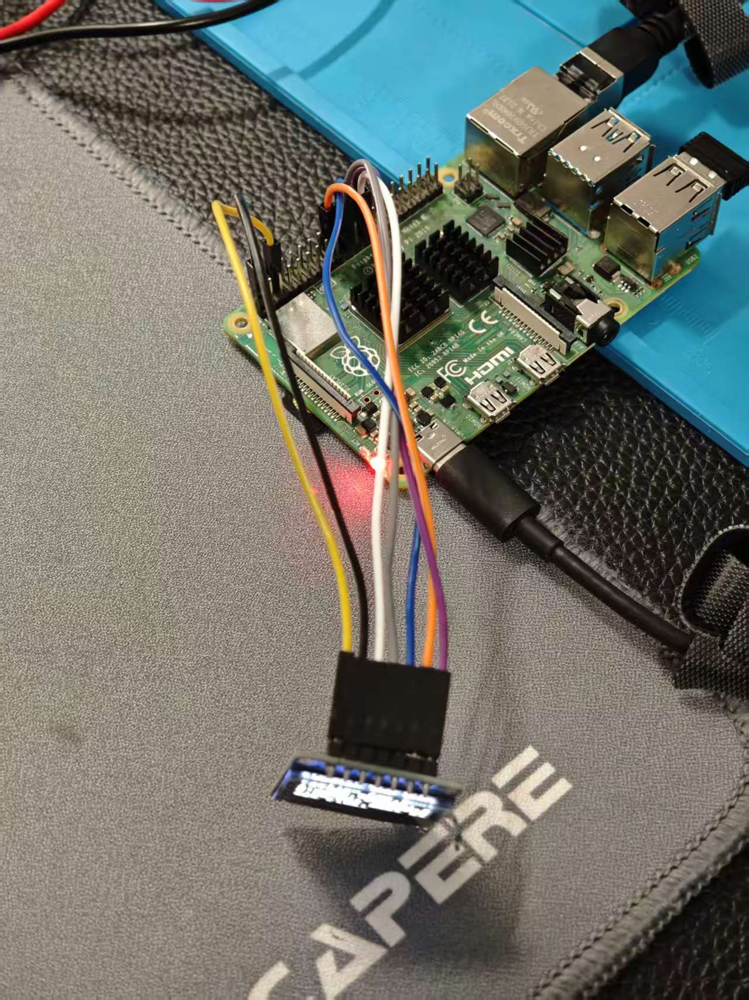
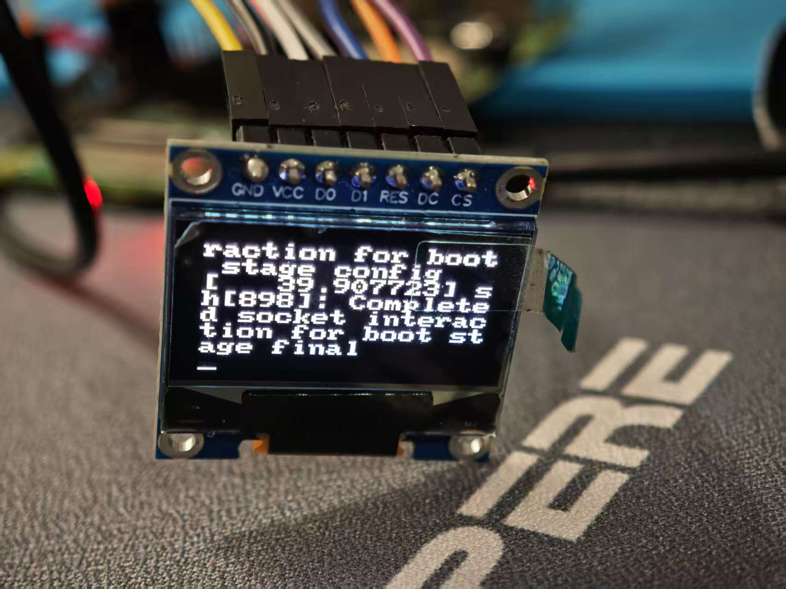
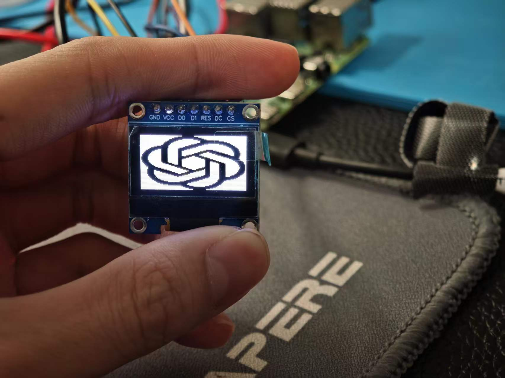
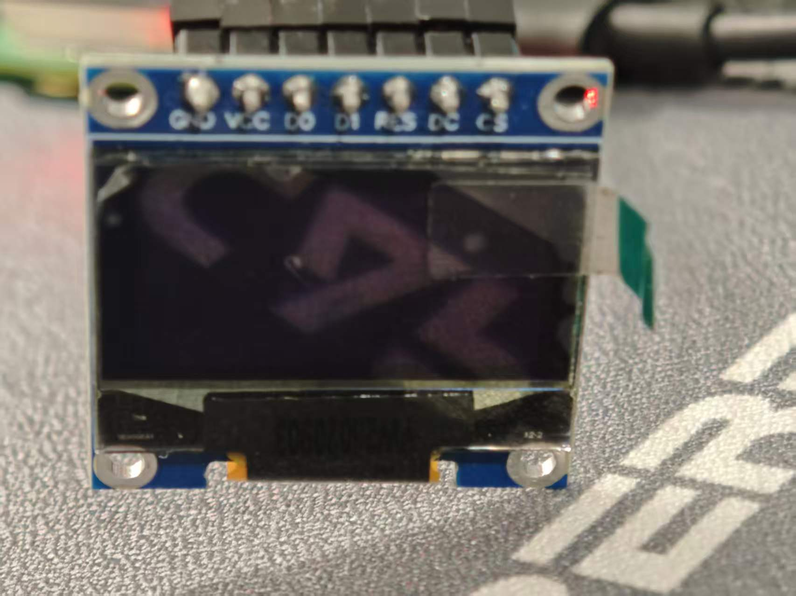
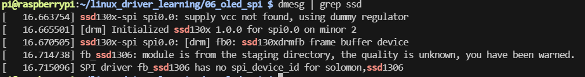

# 06_spi_oled (SSD1306 SPI Framebuffer)

> Linux SPI + Framebuffer + SSD1306
> 在 Raspberry Pi 上驱动 0.96" OLED，并通过 `/dev/fb0` 直接绘图。

------

## 📷 实物与运行效果

### 🔧 硬件连接



------

### 🖥 系统控制台输出到 OLED



------

### 🎨 图片显示效果



------

### 🧹 清屏效果



------

### 📜 驱动加载日志



------

# 🎯 项目目标

- 理解 SPI 子系统
- 理解设备树 overlay
- 理解 framebuffer 注册流程
- 掌握 `/dev/fb0` mmap 绘图
- 理解 fbcon 与 tty 绑定关系

------

# 🧱 硬件信息

- 控制器：SSD1306
- 分辨率：128x64
- 接口：SPI
- 使用 SPI0 CS0
- DC：GPIO24
- RST：GPIO25

------

# 🛠 启用 SPI

```bash
sudo raspi-config
Interface → SPI → Enable
```

或：

```bash
echo "dtparam=spi=on" | sudo tee -a /boot/firmware/config.txt
```

------

# 🌳 设备树 Overlay

文件：

从`\rpi-linux\arch\arm\boot\dts\overlays\ssd1306-overlay.dts` 复制

```
my-oled-overlay.dts
```

编译：

```bash
dtc -@ -I dts -O dtb -o my-oled.dtbo my-oled-overlay.dts
sudo cp my-oled.dtbo /boot/firmware/overlays/
```

在 `/boot/firmware/config.txt` 添加：

```bash
dtoverlay=my-oled
```

重启。

------

# 🔍 验证驱动加载

```bash
dmesg | grep ssd1306
```

应该看到：

```
fb0: ssd1306 frame buffer device
```

确认 framebuffer：

```bash
ls /dev/fb0
```

------

# 🖼 显示图片

文件：

```
show_image.py
chatgpt.png
```

运行：

```bash
python3 show_image.py
```

------

# 🧹 清屏

文件：

```
clear.py
```

运行：

```bash
python3 clear.py
```

------

# 🖥 为什么 OLED 会显示 Linux 终端？

当 SSD1306 注册为 framebuffer 后：

```
fb0 → 被 fbcon 绑定 → 成为系统 console
```

所以：

- 内核日志
- 登录提示
- tty 输出

都会显示在 OLED 上。

这是 Linux framebuffer console 的默认行为。

------

# 🔓 解绑 framebuffer console（推荐）

如果你希望 OLED 仅用于图形显示，可以解绑 fbcon：

```bash
echo 0 | sudo tee /sys/class/vtconsole/vtcon1/bind
```

解绑后：

- OLED 不再显示终端
- `/dev/fb0` 仍可正常使用

------

# 🧠 技术结构图

```
User Space (Python mmap)
        ↓
/dev/fb0
        ↓
fbdev
        ↓
ssd1306 driver
        ↓
SPI controller
        ↓
OLED
```

当绑定 console 时：

```
tty1
  ↓
fbcon
  ↓
fb0
```

------

# 📂 项目结构

```
06_oled_spi/
│
├── images/
│   ├── hardware.jpg
│   ├── console_on_oled.jpg
│   ├── chatgpt_display.jpg
│   ├── clear_screen.jpg
│   └── dmesg_output.png
│
├── chatgpt.png
├── show_image.py
├── clear.py
├── my-oled-overlay.dts
├── my-oled.dtbo
└── README.md
```

------

# 🎓 本项目学到的核心能力

- SPI 设备树绑定
- 关闭 spidev 冲突
- framebuffer 注册流程
- mmap 显存操作
- stride / 像素格式处理
- fbcon 机制理解

------

# 🚀 下一步

为后续项目打基础：

- SPI LED Ring（APA102）
- DRM tiny 驱动
- ASoC 显示调试辅助屏